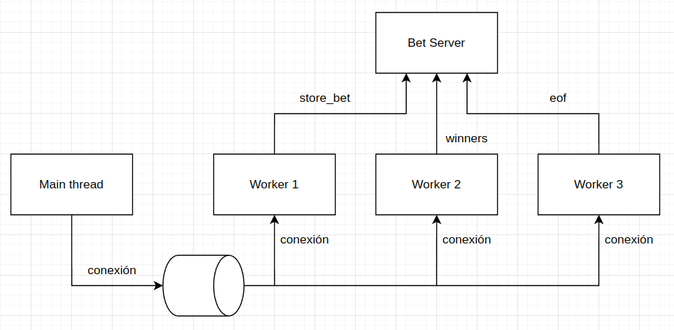

# Concurrencia

Para implementar el procesamiento de mensajes en paralelo se tomaron en cuenta las siguientes consideraciones:
- Las operaciones `store_bets` y `load_bets` no son paralelizables, en todo momento sólamente un proceso puede 
estar ejecutando cualquiera de las dos.

Debido a esta limitación se decidió centralizar todas las operaciones que requieran almacenar o cargar las 
apuestas en un único trabajador que concentra las operaciones sobre el archivo.

Para el manejo de conexiones de los clientes, se implementó un pool de workers de modo que cada worker pueda
atender una conexión de un cliente. El servidor puede atender simultáneamente tantas conexiones como workers
tenga, y el resto de las conexiones quedará en espera hasta que se libere algun worker.

Los workers publican las operaciones sobre las apuestas a través de un pipe al worker central de apuestas, y
este último es el que se encarga de actualizar el estado interno.

## GIL
Para evitar problemas de rendimiento debidos al Global Interpreter Lock, se decidió utilizar el módulo `multiprocessing`
en lugar de hilos. Toda la comunicación entre procesos se realiza a través de Pipes y Queues de este mismo módulo, 
evitando así la necesidad de sincronizar memoria compartida ya sea con locks, barreras o semáforos.

## Modelo de comunicación entre procesos

Durante la ejecución del servidor corren los siguientes procesos:
- Hilo principal del servidor: (único) se encarga de aceptar conexiones nuevas y encolarlas para que alguno de los workers
la maneje.
- Bet worker: (único) proceso que realiza todas las operaciones sobre el archivo de apuestas, recibe y envía información a
los workers a traves de pipes.
- Client worker: (múltiples) procesos que manejan la conexión con el usuario, reciben comandos desde la red y se comunican
con el bet worker a través de pipes.

